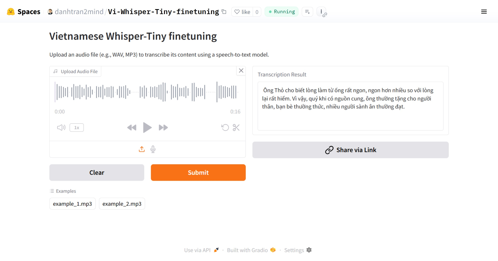

# Vietnamese Whisper tiny finetuning

## Introduction

## Key Features

## Base Model

## Demonstration
Experience real-time Vietnamese TTS generation:  
- **HuggingFace Space**: [](https://huggingface.co/spaces/danhtran2mind/Viet-Glow-TTS-finetuning)  

- **Demo GUI**:  
  

To run the Gradio app locally (`localhost:7860`):  
```bash
python app.py
```

## Installation

### Step 1: Clone the Repository
Clone the project repository and navigate to the project directory:  
```bash
git clone https://github.com/danhtran2mind/Vi-Whisper-tiny-finetuning.git
cd Vi-Whisper-tiny-finetuning
```

### Step 2: Install Dependencies
Install the required Python packages:  
```bash
pip install -r requirements.txt
```

## Usage

### Run Gradio App Locally
Launch the Gradio app for interactive TTS generation:  
```bash
python app.py
```

### Using Python API
Generate ASR Text output programmatically:  
```python
# Load audio file (replace 'audio.wav' with your audio file path)
audio_path = "tests/test_data/example.mp3"
audio, sr = librosa.load(audio_path, sr=16000)

# Preprocess audio
inputs = processor(audio, sampling_rate=16000, return_tensors="pt").to(device)

# Perform inference with max_length and language
with torch.no_grad():
    generated_ids = model.generate(
        inputs["input_features"],
        max_length=448,
    )

# Decode the output
transcription = processor.batch_decode(generated_ids, skip_special_tokens=True)[0]

# Print the transcription
print(transcription)

# Ông Thỏ cho biết, lòng làm từ ông rất ngon, ngon hơn nhiều so với lòng, lại rất hiếm. Vì vậy, 
# buổi khi có nguồn cung, ông thường tặng cho người thân, bạn bè thường thức. Nhiều người sành ăn 
# thường đạt.
```


## Inference Examples

